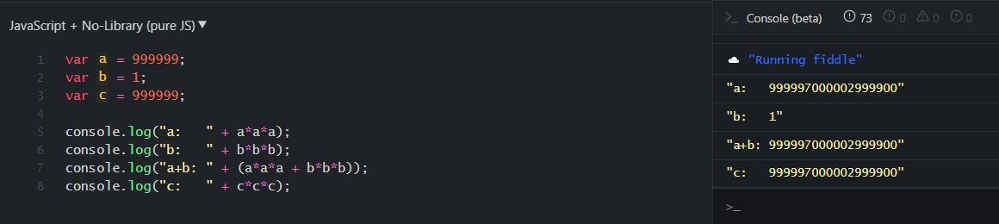

# Serial

## Description
```
Author: Artur Khanov (@awengar)

We have OSINTed a part of algorithm for serial code verification. Help us hack it! Our mathematicians say it's impossible!

109.233.57.94:46090/
Source code: serial.tar.gz
```

## Preview

```js
[1.js]

var http = require('http');
var url = require('url');
var parse = require('querystring');
var fs = require('fs');
var index = fs.readFileSync('index.html');
var flag = fs.readFileSync('flag.html');
var err = fs.readFileSync('error.html');

http.createServer(function (req, res) {  
  var q = url.parse(req.url, true)
  if (q.path == "/"){
    res.writeHead(200,{"Content-Type": "text/html"});
    res.write(index); //write a response to the client
    res.end(); //end the response
  }
  else if (q.path == "/enter"){
    if (req.method === 'POST') {
      var body = '';
      req.on('data', chunk=> {body += chunk.toString()});
      req.on('end', () => {
          body = parse.parse(body);
          var a=parseInt(body.serial1),b=parseInt(body.serial2),c=parseInt(body.serial3);
          console.log("Serial:",a,b,c)
          if ( (a>0 && a < 1000000) & (b>0 && b < 1000000) & (c>0 && c < 1000000) & a*a*a + b*b*b == c*c*c){
              res.writeHead(200,{"Content-Type": "text/html"});
              res.write(flag);
              res.end();
          }
          else{
              res.writeHead(200,{"Content-Type": "text/html"});
              res.write(err);
              res.end();
          }
        }
       )
      };
    }
  else{
        res.writeHead(404,{"Content-Type": "text/html"});
        res.write("<h1>404 Not found</h1>");
        res.end();
   }
  }
).listen(8081);
```

## Checkpoint
```
var a = parseInt(body.serial1), b = parseInt(body.serial2) , c = parseInt(body.serial3);

if ( (a>0 && a < 1000000) & (b>0 && b < 1000000) & (c>0 && c < 1000000) & a*a*a + b*b*b == c*c*c)
```


## Flag
cybrics{CYB3R_M47H_15_57R4Ng3}
