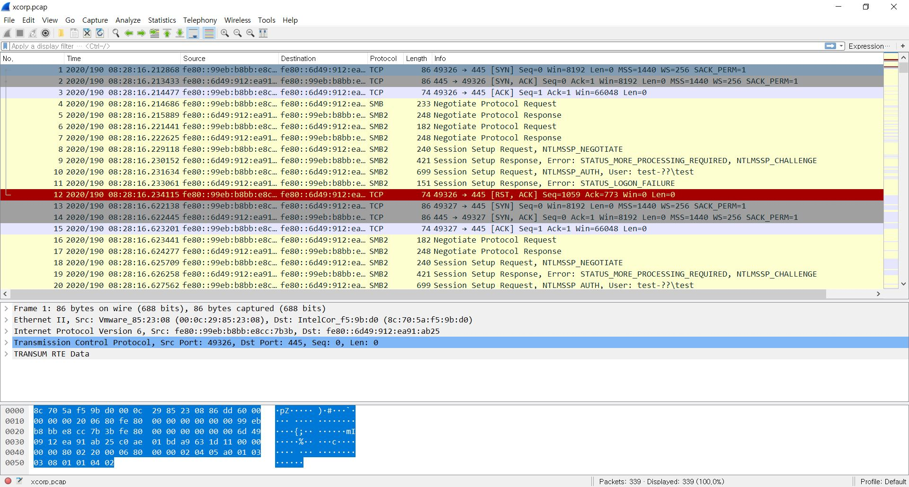
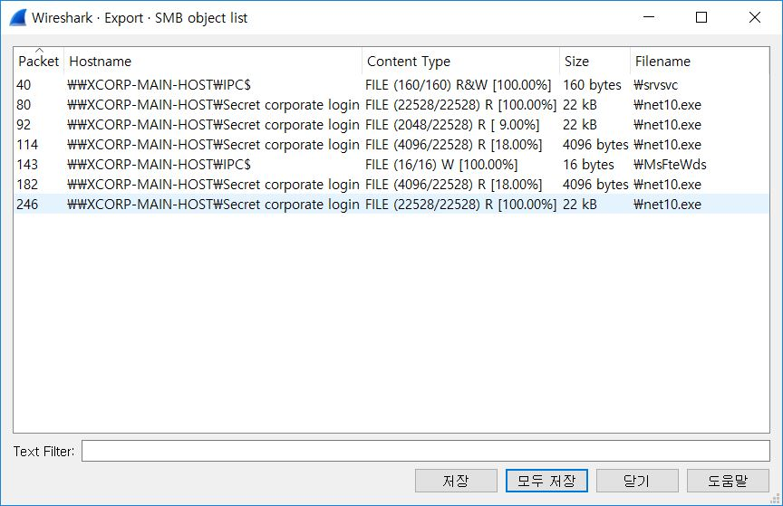
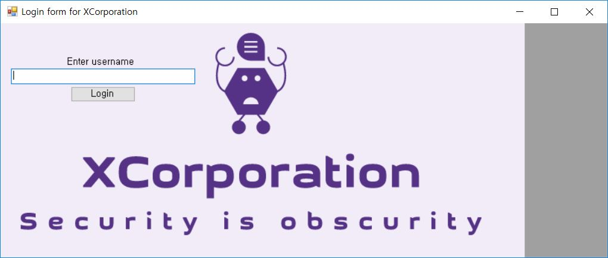
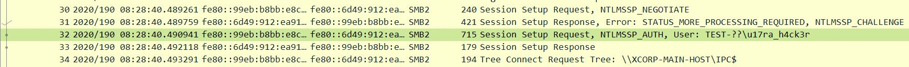
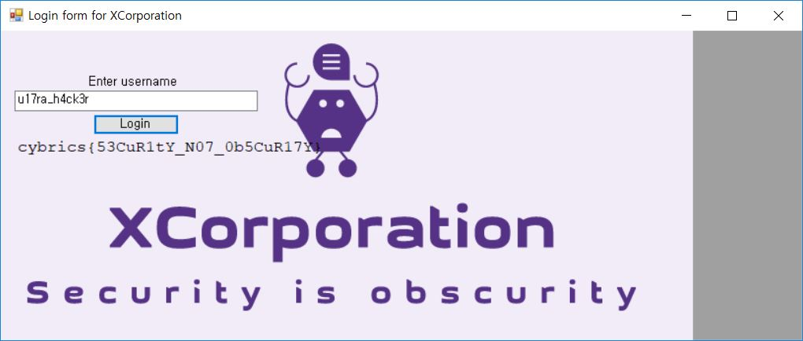

# Xcorp

## Description
```
Author: Artur Khanov (@awengar)

We got into the XCorp network and captured some traffic from an employee's machine. Looks like they were using some in-house software that keeps their secrets.

xcorp.tar.gz
```

## Preview
Unzip has a pcap file.



## Checkpoint
In-house software and username.

step1 - Extract files from wireshark.



step2 - Execute extracted files.



step3 - Find a user in the pcap.



step4 - Input username.



## Flag
cybrics{53CuR1tY_N07_0b5CuR17Y}
